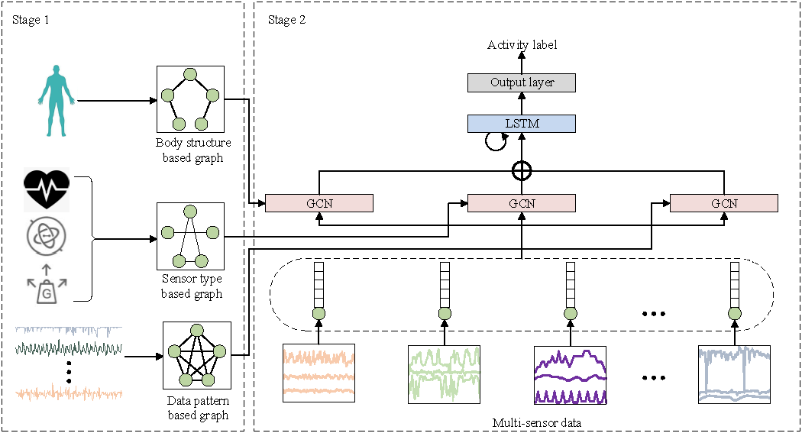

# MG-WHAR

This repository is the official implementation of A Multi-Graph Convolution Network Based
Wearable Human Activity Recognition Method Using Multi-Sensors

# 1 The framework of MG-WHAR

<div align=center>
<br/>
<div align=left>


# 2 Prerequisites

To run our code you will need to install the requirements indicated in the requirements.yml file included in the repository and install PyTorch. Before that, you need install anaconda. Those operations must be done on Linux or WSL. Once that is done, run.

```shell
conda env create -f requirements.yml
conda activate torch
```

The cpu version Pytorch are included in requirements.yml. If you need install PyTorch cuda version, please [following](https://pytorch.org/get-started/locally/) to reinstall PyTorch.

# 3 Running

After installing all dependencies in the requirements.yml file and PyTorch you will be able to run the main.sh script. Use 

```shell
./main.sh
```

This script mainly contains 4 steps.

1. Download the raw data from the website
2. Preprocess the raw data
3. Generate data pattern based graph
4. Train and test our method.

# 4 Acknowledgements

The preprocessed code and the framework are based on [DeepConvLSTM_py3](https://github.com/STRCWearlab/DeepConvLSTM_py3). Great thanks to the original authors for their work!

We also thank the reviewers for their highly valuable comments on the paper.


# 5 Citation

Please cite this work if you find it useful.